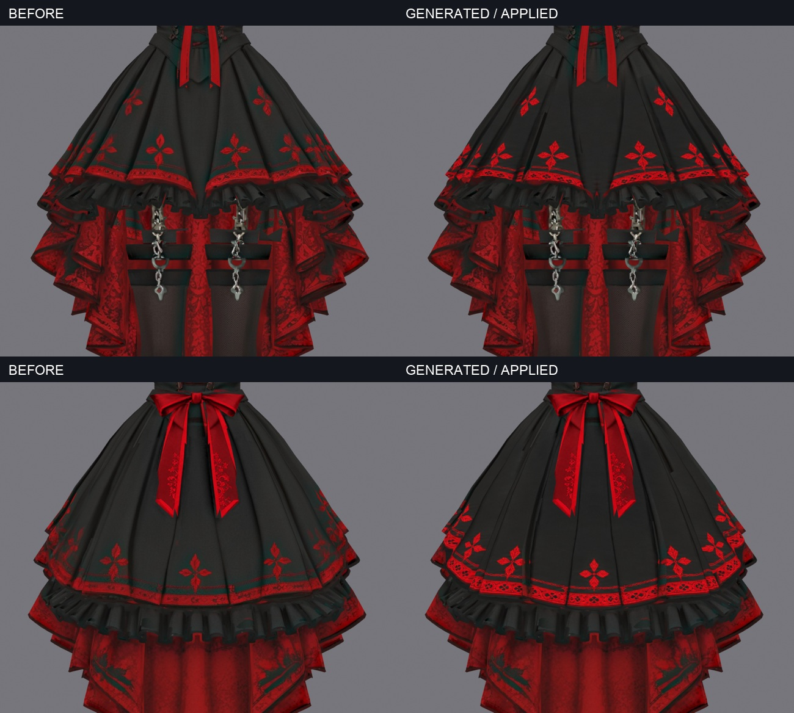

# Blender＋Astraで、3Dモデルをもっと自分好みに

Tripoで作った3Dモデルの衣装を、画像生成したテクスチャで仕上げるための手順です。
**このリポジトリのURLと「この手順で一部位から仕上げて」をAstraへ渡す**ところから始められるよう、作業指示と実プロンプトをまとめました。

**かわいいは作れる。**



各段とも左が変更前、右が変更後。上段は正面、下段は背面。同じ形状・画角の色だけの表示で、黒いスカート表地の柄を比べています。画像生成に加え、位置合わせと貼り分けも行っています。

## 使い方

モデルをBlenderで開き、Astraへ次を渡してください。

```text
https://github.com/syaripin-i8i/blender-astra-texture-guide

このリポジトリのREADMEとAGENTS.mdを読んで、
Blenderで開いているモデルの衣装テクスチャを一部位から仕上げて。
今の色柄を基準に、顔・瞳・髪・形状・動きを保持し、
画像生成から貼り付け、変更前後の比較まで進めて。
```

目標の色や柄がある場合は、参考画像も添えてください。部位を決めていなくても、Astraがモデルを調べて最初の小範囲を選ぶ手順です。

**Astra向けの実行手順：[AGENTS.md](AGENTS.md)** — 読み取り → バックアップ → 部位・UV解析 → 画像生成 → 位置補正と貼り分け → 比較 → 確認版の保存。

## 前提

- **Tripoで生成した、既存UVとカラーテクスチャがあるモデルで検証。** Blenderで元画像が表示できる状態から始めます。
- BlenderとAstra、参考画像を入力できる画像生成機能、Blenderの読み取り・操作手段が必要です。今回はBlender MCPとBlenderのPython実行を使いました。
- 他サービス由来のモデル、テクスチャなしのモデルは未検証。別モデルではUV・貼る範囲・位置補正をその都度作ります。

接続や元画像が足りなければ、Astraが不足を確認します。URLだけでBlenderや画像生成の機能が追加されるわけではありません。対象ファイルや部位を指定したい場合は [開始指示](START.md) を使ってください。

## 作業後に受け取るもの

元データを保護した確認版、生成画像、実際に使ったプロンプト、UV・貼り分けの対応データ、変更前後の比較、戻し方。一部位の結果を確認してから、同じ素材や隣の部位へ広げます。

## 実際に使った画像生成プロンプト

今回の実行時の本文です。各ファイルで指定している入力画像や部位は、自分のモデルに合わせて組み立てます。

| 部位 | 全文 |
|---|---|
| 最初の袖パネル | [01](prompts/pilot_left_sleeve_actual_01.txt) |
| 左右共通の袖素材 | [02](prompts/shared_sleeve_actual_02.txt) |
| 赤い後ろリボン | [03](prompts/rear_bow_actual_03.txt) |
| スカート外側 | [04](prompts/skirt_actual_04.txt) |
| 赤い下布 | [05](prompts/crimson_drape_actual_05.txt) |
| 胴体正面と前リボン | [06](prompts/bodice_actual_06.txt) |
| 脚・靴の4素材 | [07](prompts/leg_materials_actual_07.txt) |

[胴体の色比較](images/bodice_before_after.jpg) ／ [四分割の生成素材](images/leg_material_atlas.png)

実作業はBlender 5.1.2。仕上げでは対象範囲の粗さ・ノーマル強度も調整しています。形状の凹凸は別工程で扱います。元モデル、全参照画像、汎用の自動適用スクリプトは含みません。このURL入口の別モデルでの通し検証はまだ行っていません。
